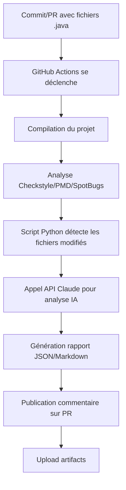

# 📂 Structure du Projet

Voici l'organisation complète du système d'AI Code Review pour Java.

## 🗂️ Arborescence

```
java-ai-code-review/
│
├── 📄 README.md                    # Documentation complète
├── 📄 QUICK_START.md               # Guide de démarrage rapide (5 min)
├── 📄 STRUCTURE.md                 # Ce fichier
├── 📄 .gitignore                   # Fichiers à ignorer
│
├── 📁 .github/
│   ├── 📁 workflows/
│   │   └── ai-code-review.yml      # Workflow GitHub Actions principal
│   │                               # Se déclenche sur PR et commits
│   │
│   └── 📁 config/
│       ├── checkstyle.xml          # Règles Checkstyle (conventions Java)
│       └── pmd-ruleset.xml         # Règles PMD (qualité de code)
│
├── 📁 scripts/
│   ├── ai_code_reviewer.py         # Script Python principal
│   │                               # Utilise Claude API pour analyser le code
│   └── requirements.txt            # Dépendances Python
│
├── 📁 examples/
│   ├── ExampleBadCode.java         # Exemple avec erreurs (pour tester)
│   └── ExampleGoodCode.java        # Exemple de bonnes pratiques
│
├── pom.xml.example                 # Configuration Maven avec plugins
└── build.gradle.example            # Configuration Gradle alternative
```

## 📋 Description des fichiers clés

### 🔧 Configuration GitHub Actions

| Fichier | Description |
|---------|-------------|
| `ai-code-review.yml` | Workflow automatique qui s'exécute sur chaque PR/commit avec des fichiers `.java` modifiés |

**Déclencheurs :**
- Pull Request (ouverture, synchronisation, réouverture)
- Push sur `main`, `develop`, `feature/**`

**Étapes :**
1. ✅ Checkout du code
2. ☕ Installation JDK 17
3. 🏗️ Compilation Maven/Gradle
4. 🔍 Analyse Checkstyle, PMD, SpotBugs
5. 🐍 Installation Python + dépendances
6. 📂 Détection des fichiers Java modifiés
7. 🤖 Analyse IA avec Claude
8. 💬 Publication du commentaire sur la PR
9. 📊 Upload des rapports

### 🤖 Script Python

| Fichier | Description |
|---------|-------------|
| `ai_code_reviewer.py` | Script qui utilise l'API Claude pour analyser le code Java |

**Fonctionnalités :**
- Lecture des fichiers Java modifiés
- Analyse complète par Claude AI
- Génération de rapports JSON et Markdown
- Publication automatique sur GitHub PR
- Détection de bugs, sécurité, performance, style

**Variables d'environnement requises :**
- `ANTHROPIC_API_KEY` : Clé API Claude (secret GitHub)
- `GITHUB_TOKEN` : Token GitHub (automatique)
- `PR_NUMBER` : Numéro de la PR (automatique)
- `REPO_NAME` : Nom du dépôt (automatique)
- `COMMIT_SHA` : SHA du commit (automatique)

### ⚙️ Fichiers de configuration

| Fichier | Outil | But |
|---------|-------|-----|
| `checkstyle.xml` | Checkstyle | Vérifie les conventions de code Java (naming, formatting, imports) |
| `pmd-ruleset.xml` | PMD | Détecte les anti-patterns et problèmes de qualité |
| `pom.xml.example` | Maven | Configuration des plugins d'analyse pour Maven |
| `build.gradle.example` | Gradle | Configuration alternative pour Gradle |

## 🎯 Flux de travail



## 📊 Catégories d'analyse

Le système analyse le code selon ces catégories :

| Catégorie | Description | Exemples |
|-----------|-------------|----------|
| 🐛 **Bugs** | Erreurs potentielles | NullPointer, division par zéro, fuites mémoire |
| 🔒 **Sécurité** | Vulnérabilités OWASP | SQL injection, XSS, données sensibles |
| ⚡ **Performance** | Optimisations | Boucles inefficaces, collections mal utilisées |
| 📐 **Style** | Conventions Java | Naming, formatting, imports |
| ✨ **Bonnes pratiques** | Design patterns | Immutabilité, SOLID, try-with-resources |
| 🧪 **Tests** | Testabilité | Code testable, couverture suggérée |

## 🎨 Niveaux de sévérité

| Niveau | Icône | Action |
|--------|-------|--------|
| Critical | 🔴 | À corriger immédiatement |
| High | 🟠 | Correction urgente |
| Medium | 🟡 | À corriger prochainement |
| Low | 🔵 | Amélioration suggérée |
| Info | ℹ️ | Information |

## 📦 Dépendances

### Python
- `anthropic` (≥0.40.0) : Client API Claude
- `requests` (≥2.31.0) : Requêtes HTTP pour GitHub API

### Maven Plugins
- `maven-checkstyle-plugin` (3.3.1)
- `maven-pmd-plugin` (3.21.2)
- `spotbugs-maven-plugin` (4.8.3.0)
- `jacoco-maven-plugin` (0.8.11)

### Gradle Plugins
- `checkstyle`
- `pmd`
- `com.github.spotbugs` (6.0.7)
- `jacoco`

## 🔐 Secrets GitHub requis

| Secret | Description | Format |
|--------|-------------|--------|
| `ANTHROPIC_API_KEY` | Clé API Claude | `sk-ant-api03-...` |

Le `GITHUB_TOKEN` est automatiquement fourni par GitHub Actions.

## 🚀 Démarrage rapide

1. **Copier les fichiers** dans votre projet Java
2. **Ajouter le secret** `ANTHROPIC_API_KEY` dans GitHub
3. **Faire un commit** avec des fichiers `.java`
4. **Le bot analyse** automatiquement ! 🎉

Voir [QUICK_START.md](QUICK_START.md) pour les détails.

## 🔧 Personnalisation

### Modifier le prompt d'analyse
Éditez `scripts/ai_code_reviewer.py` ligne 99+

### Ajuster les règles de qualité
- Checkstyle : `.github/config/checkstyle.xml`
- PMD : `.github/config/pmd-ruleset.xml`

### Changer les branches surveillées
Éditez `.github/workflows/ai-code-review.yml` ligne 8-12

### Utiliser un autre modèle Claude
Éditez `scripts/ai_code_reviewer.py` ligne 62 :
```python
self.model = "claude-opus-4-5"  # Plus puissant mais plus cher
```

## 📈 Évolutions futures possibles

- [ ] Support de Kotlin et Scala
- [ ] Intégration SonarQube
- [ ] Analyses incrémentales (seulement les lignes modifiées)
- [ ] Cache des résultats
- [ ] Dashboard de métriques
- [ ] Suggestions de refactoring automatique
- [ ] Génération automatique de tests unitaires

## 🆘 Support

Problème ? Consultez :
1. [README.md](README.md) - Documentation complète
2. [QUICK_START.md](QUICK_START.md) - Guide de démarrage
3. Logs GitHub Actions - Onglet "Actions" dans votre dépôt

---

**Créé avec ❤️ et Claude AI**
